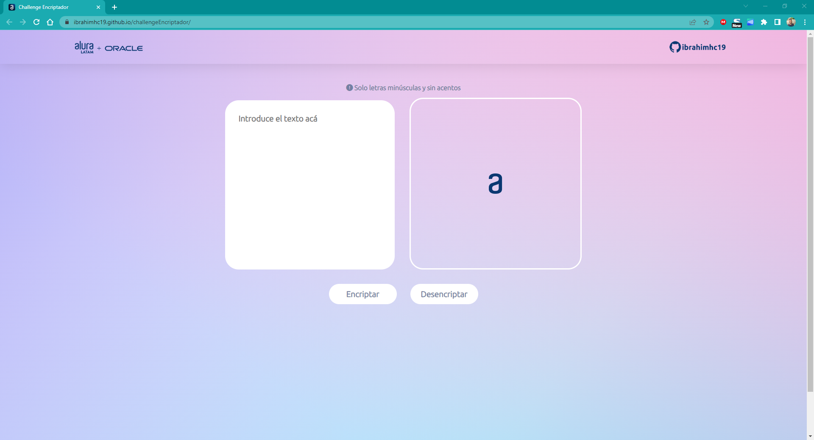
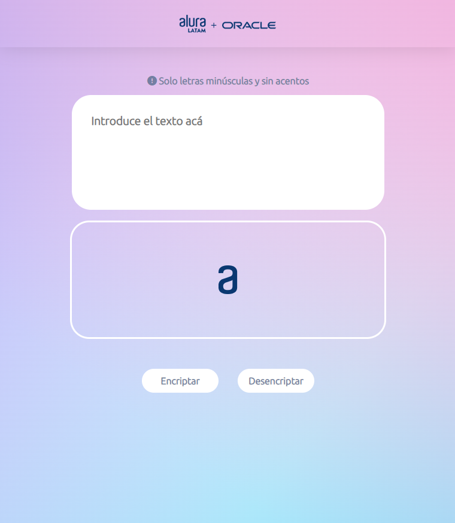
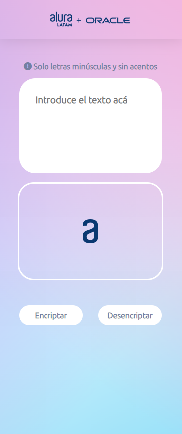

# Encriptador de Texto - Oracle ONE - Alura

Este proyecto es parte de mi formación como desarrollador en el programa Oracle ONE - Alura. Consiste en un sencillo encriptador de texto que cumple con los criterios establecidos en el desafío.

## Instrucciones

Las instrucciones completas del desafío se encuentran en el siguiente enlace: [Trello - Desafío Oracle ONE - Alura](https://trello.com/c/fruTcqMC)

## Características adicionales

Para hacer que el proyecto sea más atractivo y profesional, he realizado algunas mejoras y añadido características adicionales:

### Diseño personalizado

- Se han utilizado imágenes distintas para el logo de Alura y la imagen mostrada en el área de texto encriptado, brindando una apariencia única al proyecto.
- Se ha agregado un header que simula una barra de navegación, con dos imágenes animadas que se amplían al pasar el cursor sobre ellas. Estas imágenes contienen enlaces a la página web de Alura Latam y a mi cuenta de GitHub.
- Se han aplicado estilos CSS distintos para darle una apariencia diferente y evitar que sea una réplica exacta de la asignación original.
- Se ha agregado un footer para completar el diseño y mejorar la presentación del proyecto.

### Diseño responsive

- El proyecto cuenta con tres vistas diferentes para adaptarse a distintos dispositivos: desktop, tablet y smartphone.
- El diseño se ajusta automáticamente según el tamaño de la pantalla, brindando una experiencia de usuario óptima en cada dispositivo.

## Demostración

Puedes ver una demostración del proyecto en vivo en el siguiente enlace: [Demo.mp4](https://github.com/ibrahimhc19/challengeEncriptador/blob/main/imagenes/Demo.mp4)

## Capturas de pantalla

Aquí se presentan algunas capturas de pantalla del proyecto en diferentes dispositivos:

### Vista Desktop

### Vista Tablet

### Vista Smartphone

## Puedes ver la página acá:

https://ibrahimhc19.github.io/challengeEncriptador/

## Recursos utilizados

- Imagen del logo de Alura: [aluraoracle.png](https://github.com/ibrahimhc19/challengeEncriptador/blob/main/imagenes/aluraoracle.png)
- Imagen para el área de texto encriptado: [Frame 6.png](https://github.com/ibrahimhc19/challengeEncriptador/blob/main/imagenes/Frame%206.png)
- CSS Reset: [reset.css](https://github.com/ibrahimhc19/challengeEncriptador/blob/main/reset.css)
- Imagen Github Ibrahim Calzadilla: [github-Ibrahimhc19.png](https://github.com/ibrahimhc19/challengeEncriptador/blob/main/imagenes/github-Ibrahimhc19.png)

## Autor

Este proyecto fue desarrollado por [Ibrahim Calzadilla Rada](https://github.com/ibrahimhc19).

<!-- ## Licencia

Este proyecto está bajo la [Licencia MIT](LICENSE). -->
